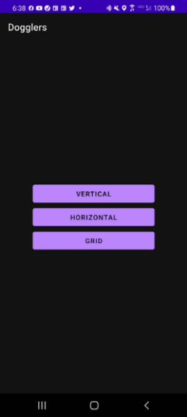
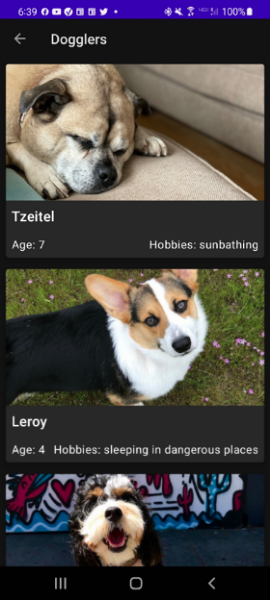
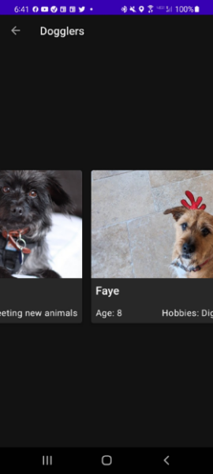
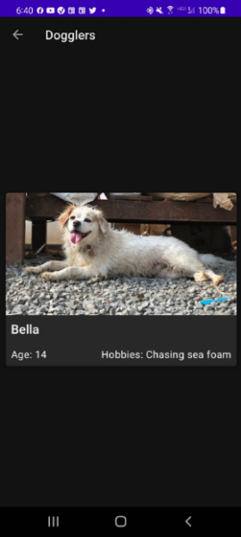
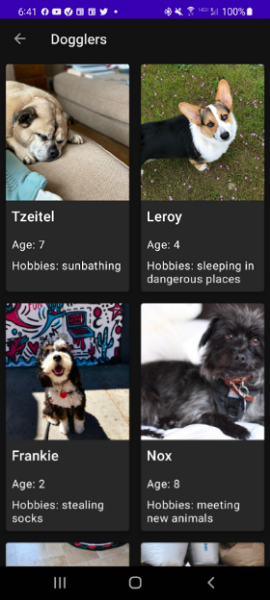

Dogglers - Starter Code - Completed
==================================

Completed starter code for the second independent project for [Google Android Basics in Kotlin](https://developer.android.com/courses/android-basics-kotlin/course).

Introduction
------------

This is the completed and tested starter code for the Dogglers app project in the [final pathway](https://developer.android.com/courses/pathways/android-basics-kotlin-unit-2-pathway-3) of Android Basics [Unit 2](https://developer.android.com/courses/android-basics-kotlin/unit-2). 

Pre-requisites
--------------

- Complete [Unit 2](https://developer.android.com/courses/android-basics-kotlin/unit-2) of Android Basics in Kotlin  

Tips
----

- Use the provided tests to ensure your app is running as expected
- DO NOT ALTER THE PROVIDED TESTS

Getting Started
---------------

1. Download the completed code
2. Open the project in Android Studio
3. Compile the app
4. Open your AVD or install on an android mobile device with developer options on.
5. Choose a view by clicking on the corresponding button
6. Scroll around, and have a HAPPY DOGGLER DAY!  

Screenshots of Dogglers!
---------------  
      
   
